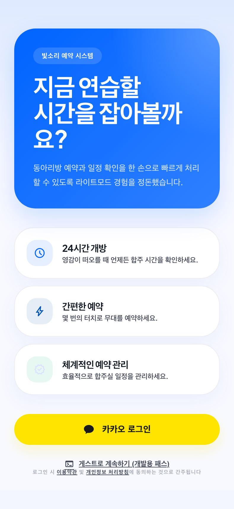
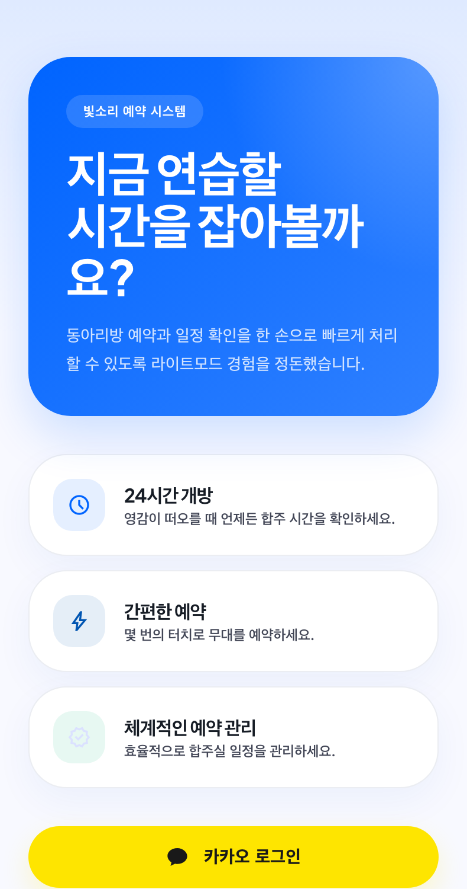
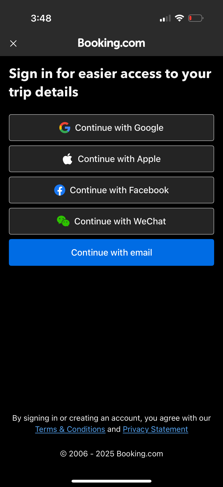

# Design Improvement: Login Screen

## TL;DR
로그인 화면은 더 화려하게 만들기보다, 첫 화면에서 "지금 무엇을 할 수 있는지"와 "왜 로그인해야 하는지"를 바로 보여주는 쪽이 맞습니다. 히어로 카드를 줄이고, 예약 현황 미리보기와 카카오 로그인 CTA를 첫 viewport 안에 안정적으로 고정하는 개편을 권합니다.

## Assumptions
- 이 앱은 단일 동아리용 합주실/동아리방 예약 PWA입니다.
- 현재 인증 진입점은 카카오 로그인이 주 경로이고, 개발용 익명 로그인은 운영 화면에서 숨겨집니다.
- 비로그인 예약 현황 공개는 정책 결정이 필요합니다. 공개한다면 개인 이름/초대자 정보 없이 "빈 시간"만 보여주는 범위로 제한해야 합니다.

## Current State

*현재 `395x750` 모바일 기준 로그인 화면. 첫 viewport에서 히어로 카드와 3개 기능 카드가 대부분을 차지하고, 카카오 CTA는 보이지만 법적 문구와 보조 흐름은 아래로 밀립니다.*


*실제 첫 viewport 캡처. 로그인 전용 화면인데 기능 홍보 카드가 많아 사용자가 해야 할 행동이 늦게 정리됩니다.*

## Improvement Ideas

### 1. Hero를 줄이고 "예약 가능 시간" 미리보기로 바꾸기
현재 대형 파란 카드의 카피는 시각적으로 강하지만, 로그인 화면에서 필요한 신뢰 정보나 예약 맥락을 거의 주지 않습니다. 첫 화면 상단을 40% 이하로 줄이고, 오늘/내일의 예약 가능 시간 칩 또는 미니 캘린더 프리뷰를 보여주면 앱의 목적이 즉시 전달됩니다.

**Inspired by:**

*Fever - 지역 이벤트 앱 로그인 화면. 배경/프리뷰로 서비스 맥락을 먼저 보여주고, 인증 옵션과 게스트 진입을 아래에 둡니다. [Lazyweb, screenshotId 65756]*


*SpotHero - 예약 앱 홈 화면에서 검색과 빠른 예약 맥락을 먼저 노출한 뒤 계정 생성 이점을 제시합니다. [Lazyweb, screenshotId 84102]*

**Why this works:** 예약 앱은 "로그인" 자체보다 "예약 가능한가"가 사용자의 첫 질문입니다. 현재 화면은 감정적 카피가 앞서고 실제 예약 맥락이 뒤에 없습니다. 미니 프리뷰는 가입/로그인의 이유를 설명 없이 보여줍니다.

**Sketch:**
```text
+--------------------------------+
| 빛소리 예약                    |
| 오늘 합주실을 바로 확인하세요  |
|                                |
| [오늘] 18:00  19:30  21:00     |
| [내일] 17:00  20:00            |
+--------------------------------+
| 카카오 로그인                  |
| 예약 현황 먼저 보기            |
+--------------------------------+
```

### 2. 3개 기능 카드를 "로그인 이점 3칩"으로 압축하기
현재 `24시간 개방`, `간편한 예약`, `체계적인 예약 관리` 카드는 같은 수준의 홍보 문구처럼 보입니다. 로그인 화면에서는 카드 3개보다 "로그인하면 얻는 것"을 작은 칩 3개로 압축하는 편이 낫습니다.

**Inspired by:**

*Booking.com - 여행 상세/예약 관리를 쉽게 보기 위해 로그인하라는 이점을 먼저 말하고, 인증 옵션을 바로 제공합니다. [Lazyweb, screenshotId 12976]*


*Booksy - 예약 관리를 위한 이메일/소셜 로그인 흐름을 간결하게 제시합니다. [Lazyweb, screenshotId 81935]*

**Why this works:** 화면 높이를 절약하고 CTA를 위로 올립니다. 특히 `24시간 개방`은 실제 운영 정책처럼 읽힐 수 있으므로, "빈 시간 확인", "중복 예약 방지", "내 예약 모아보기"처럼 기능 결과 중심으로 바꾸는 것이 안전합니다.

**Sketch:**
```text
+--------------------------------+
|  빈 시간 확인  |  중복 방지    |
|  내 예약 보기  |  승인 부원용  |
+--------------------------------+
```

### 3. 카카오 로그인 버튼은 공식 가이드에 맞춰 낮고 단단하게 정리하기
현재 카카오 버튼은 노란색과 말풍선 아이콘 방향은 맞지만, 전체가 `round-full` pill 형태라 Kakao 공식 가이드의 12px radius와 다릅니다. 운영 로그인 버튼은 인증 제공자 정체성을 훼손하지 않는 쪽이 더 안전합니다.

**Inspired by:**
- Kakao Developers Design Guide: container `#FEE500`, symbol `#000000`, label `#000000 85%`, container radius 12px.
- Apple HIG도 소셜 로그인 버튼은 다른 로그인 버튼보다 작거나 늦게 보이면 안 된다고 안내합니다.

**Why this works:** 이 앱은 카카오가 사실상 단일 운영 인증 경로입니다. CTA는 크고 명확하되, 과한 pill/그림자보다 공식 로그인 컴포넌트처럼 단정해야 신뢰도가 올라갑니다.

**Sketch:**
```text
+--------------------------------+
|  [kakao icon]  카카오 로그인   |
+--------------------------------+
| 로그인 시 약관 및 개인정보... |
```

### 4. "게스트"는 개발용과 운영용을 분리해서 설계하기
현재 개발용 게스트 버튼은 운영 빌드에서 숨겨지지만, 문구가 화면 흐름 안에 섞여 있어 개발 흔적처럼 느껴집니다. 운영에 게스트/미리보기가 필요하면 `예약 현황 먼저 보기`로 별도 정책을 세우고, 개발용 패스는 테스트 빌드에서만 작게 유지하는 것이 좋습니다.

**Inspired by:**

*Fever - 인증 옵션과 별도로 "Enter as a guest"를 제공합니다. [Lazyweb]*


*SpotHero - 먼저 예약 탐색 경험을 제공하고, 계정 생성 이점을 나중에 제시합니다. [Lazyweb]*

**Why this works:** 사용자가 예약 가능 여부만 보려는 상황에서는 로그인 장벽이 무겁습니다. 다만 이 저장소는 이전 점검 기준으로 단일 동아리 전역 모델이며 tenant boundary가 약하므로, 공개 범위는 개인정보 없는 availability로 제한해야 합니다.

**Sketch:**
```text
+--------------------------------+
| 카카오 로그인                  |
| 예약 현황 먼저 보기            |
|                                |
| 개발용 게스트 패스             |
+--------------------------------+
```

### 5. Desktop에서는 모바일 카드 확대가 아니라 split utility layout 사용하기
현재 데스크톱 캡처도 모바일형 카드가 중앙에 커지는 구조입니다. PWA가 모바일 중심이어도 데스크톱 접속자는 관리자/부원일 가능성이 있어, 좌측은 서비스 맥락, 우측은 로그인 패널로 분리하는 쪽이 자연스럽습니다.

**Inspired by:**
Lazyweb desktop 검색 결과 중 VEED/Drumroll류 로그인은 로그인 폼을 작게 고정하고 보조 설명을 옆에 둡니다. 이 앱에는 마케팅 문구보다 "오늘 예약 요약" 또는 "운영 공지"가 더 적합합니다.

**Sketch:**
```text
+-------------------+----------------+
| 오늘 예약 요약    | 빛소리 예약    |
| 18:00 보컬        | 카카오 로그인  |
| 20:00 합주        | 약관/개인정보  |
+-------------------+----------------+
```

## What's Working
- 카카오 로그인 하나로 인증 경로가 명확합니다.
- 파란 히어로와 노란 카카오 CTA의 대비는 강해서 주 행동은 찾기 쉽습니다.
- 법적 문구와 약관/개인정보 링크가 이미 존재합니다.
- 모바일 폭에서 큰 레이아웃 깨짐은 없고, CTA도 첫 viewport 하단에 걸쳐 보입니다.

## Proposed Implementation Plan
1. `src/routes/Login.tsx`의 상단 히어로를 compact header + 예약 프리뷰 영역으로 교체합니다.
   - verify: `395x750` viewport에서 카카오 CTA와 약관 문구가 스크롤 없이 보이는지 캡처합니다.
2. 3개 `surface-card` 기능 설명을 2줄 chip/mini benefit row로 압축합니다.
   - verify: 긴 한국어 문구가 줄바꿈되어도 CTA 위치가 밀리지 않는지 확인합니다.
3. 카카오 버튼을 공식 색상/아이콘/12px radius 기준으로 정리하고, shadow를 낮춥니다.
   - verify: 버튼 높이, label, icon contrast를 Kakao guide와 대조합니다.
4. 운영용 보조 흐름은 `예약 현황 먼저 보기` 여부를 결정한 뒤 구현합니다.
   - verify: 공개 데이터가 개인 프로필/초대자/예약자 이름을 노출하지 않는지 확인합니다.
5. 데스크톱 breakpoint에서 split layout을 적용합니다.
   - verify: `1280x900` 캡처에서 모바일 카드가 과하게 커지지 않는지 확인합니다.

## All References
- Fever mobile login: hero event grid, multiple auth options, guest entry. `references/lazyweb-fever-login.png` [Lazyweb]
- Booking.com mobile sign-in: reservation/trip management benefit before auth. `references/lazyweb-booking-login.png` [Lazyweb]
- Booksy mobile auth: appointment booking account entry with compact email/social options. `references/lazyweb-booksy-login.png` [Lazyweb]
- SpotHero account prompt: booking/search value first, account benefit second. `references/lazyweb-spothero-account-prompt.png` [Lazyweb]
- Kakao Developers Design Guide: official Kakao Login button color, label, symbol, radius. https://developers.kakao.com/docs/latest/en/kakaologin/design-guide [Web]
- Apple HIG Sign in with Apple: social login buttons should be prominent and not require scrolling. https://developer.apple.com/design/human-interface-guidelines/sign-in-with-apple [Web]

## Notes
- Lazyweb image comparison was attempted with the current screenshot but the remote image embedding endpoint rejected the generated screenshots as invalid/corrupt. The report therefore uses the actual current screenshot plus Lazyweb text searches with `visionDescription` verification.
