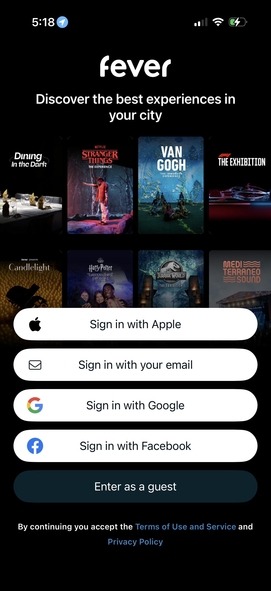
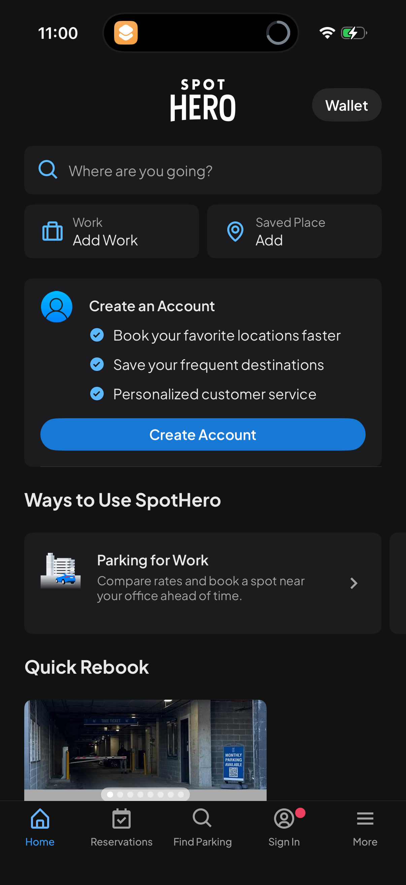
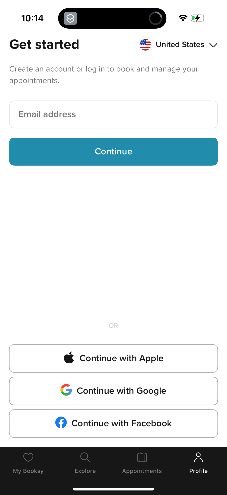

# Quick References: Mobile Login / Reservation Auth

## TL;DR
예약형 앱 로그인은 "멋진 환영 화면"보다 "예약 맥락 + 짧은 이점 + 즉시 인증" 패턴이 강합니다. 특히 이 앱은 대형 히어로와 3개 카드보다, 예약 가능 시간 프리뷰와 카카오 CTA를 첫 viewport에 함께 두는 편이 맞습니다.

## Current State

*현재 로그인 화면. 서비스 맥락보다 큰 홍보 카드가 먼저 보이고, 실제 예약 행동은 카카오 로그인 뒤로 숨겨져 있습니다.*

## Patterns

### Pattern A: 서비스 맥락을 비주얼/프리뷰로 먼저 보여준다

*Fever - 지역 이벤트 프리뷰를 배경으로 보여주고 로그인/게스트 진입을 배치합니다. [Lazyweb]*


*SpotHero - 주차 검색/예약 맥락을 먼저 보여준 뒤 계정 생성 이점을 안내합니다. [Lazyweb]*

공통점은 로그인 전에 사용자가 얻을 결과를 먼저 보여준다는 점입니다. 빛소리 예약도 "오늘 빈 시간" 또는 "다가오는 예약"을 보여주면 히어로 카피보다 설득력이 큽니다.

```text
+--------------------------------+
| 오늘 예약 가능 시간            |
| 18:00  19:30  21:00            |
| 카카오 로그인                  |
+--------------------------------+
```

### Pattern B: 로그인 이점은 작게, CTA는 크게 둔다

*Booking.com - trip detail 접근성을 로그인 이유로 제시하고 인증 버튼을 바로 보여줍니다. [Lazyweb]*


*Booksy - 예약/일정 관리를 위한 계정 진입을 이메일/소셜 로그인으로 단순화합니다. [Lazyweb]*

이 패턴은 현재 3개 feature card를 대체하기 좋습니다. "24시간 개방" 같은 모호한 문구보다 "내 예약 모아보기", "빈 시간 확인", "중복 예약 방지"처럼 로그인 후 얻는 결과를 짧게 제시합니다.

### Pattern C: 게스트/미리보기는 보조 행동으로 분리한다
Fever와 SpotHero는 인증을 강요하기 전에 게스트 또는 탐색 흐름을 남깁니다. 이 앱도 운영 정책상 가능하다면 `예약 현황 먼저 보기`를 보조 버튼으로 둘 수 있습니다. 단, 공개 범위는 개인정보 없는 availability로 제한하는 것이 전제입니다.

```text
+--------------------------------+
| 카카오 로그인                  |
| 예약 현황 먼저 보기            |
+--------------------------------+
```

### Pattern D: 소셜 로그인 버튼은 제공자 가이드를 따른다
Kakao Developers 공식 가이드는 카카오 로그인 버튼의 색상, 심볼, 라벨, radius를 지정합니다. 현재 노란색은 맞지만 pill 형태와 커스텀 아이콘은 재검토 대상입니다.

## Reference Index
- Fever: `references/lazyweb-fever-login.png`
- SpotHero: `references/lazyweb-spothero-account-prompt.png`
- Booking.com: `references/lazyweb-booking-login.png`
- Booksy: `references/lazyweb-booksy-login.png`
- Kakao guide: https://developers.kakao.com/docs/latest/en/kakaologin/design-guide
- Apple HIG: https://developer.apple.com/design/human-interface-guidelines/sign-in-with-apple
